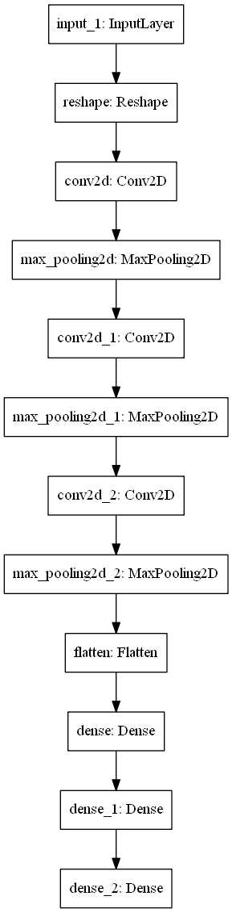
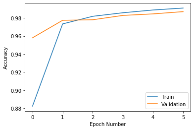
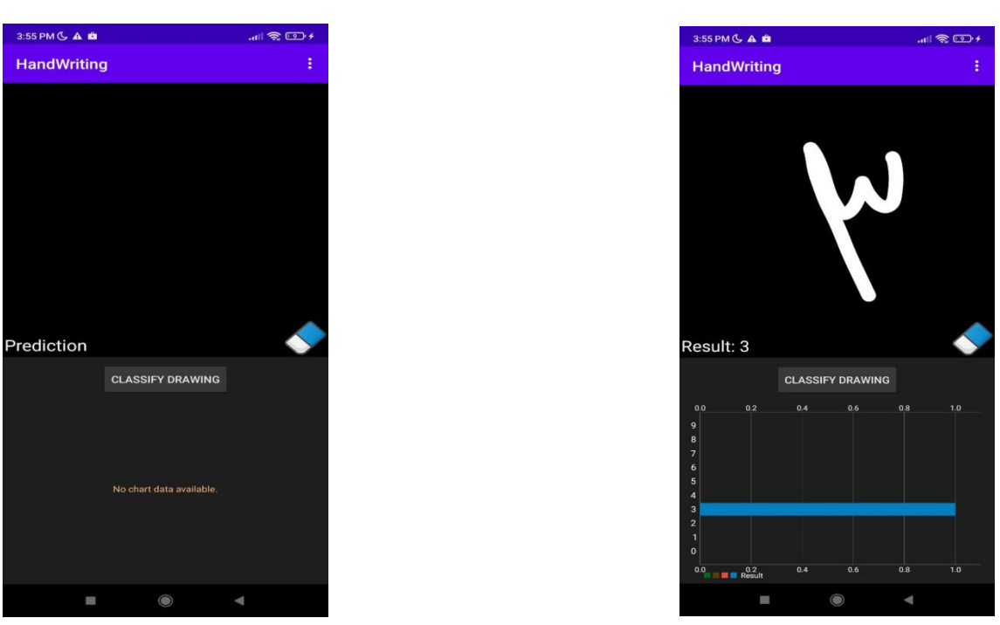

# Android Tensorflow Digits Recognition
An Android app to recognize **YOUR** hand-writen digits

# Contents:
- [Overview](#overview)
- [Releases](#releases)
- [Requirements](#requirements)
- [CNN Model](#model)
- [Training Process](#training)
- [How to use](#use)
- [Results](#results)
- [Resources](#resourses)
- [Find Me](#findMe)

## Overview: 
In this project, I will create a simple convolutional neural network [CNN] to classify handwriting digits using MNIST dataset using TensorFlow 
The main goal is to deploy this network to android app using TFLite

## Releases: 
Download The APK file:
- [Version 1.0](https://github.com/IbrahimOmar91/Android-Tensorflow-digits-recognition/releases/download/v1.0/TFLiteHandWriting.apk "Version 1.0") 

## Requirements: 
- Python 3
- Tensorflow v2 (I used v2.1.0)
- Android Studio (I used v3.6.3 with SDK: 29)

## CNN Model: 

## Training Process:  

## How to use:  
Just build the App in android studio, when it runs write whatever you want.

## Results:  
### Some Straightforward inputs:

## Used Resources: 
- Paint: I used this awesome tutorial https://www.youtube.com/watch?v=uJGcmGXaQ0o
- Visualized results: The famous MPAndroidChart https://github.com/PhilJay/MPAndroidChart
